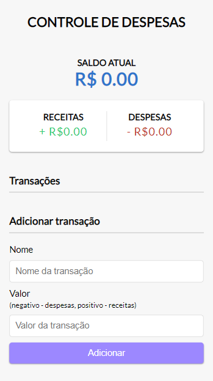
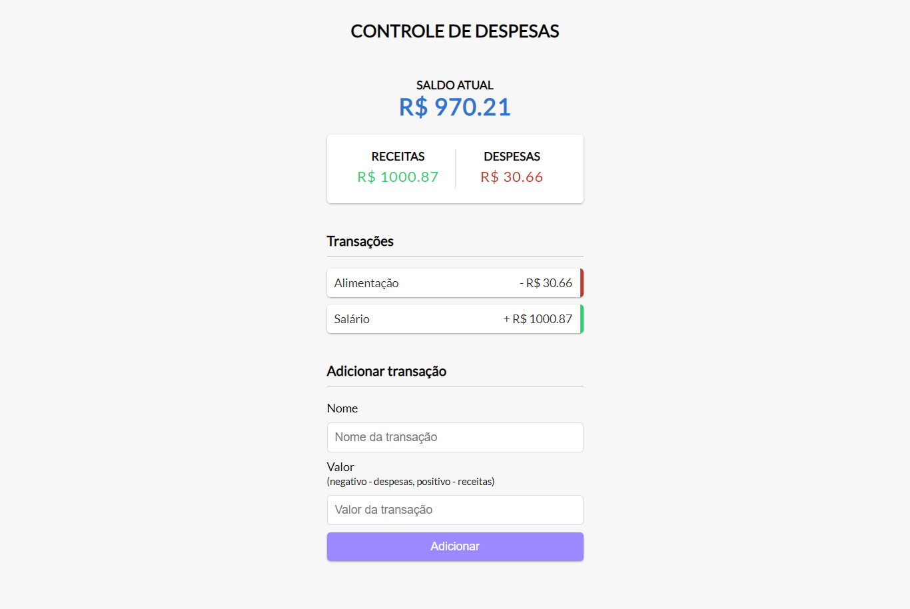

## 💻 Controle de Despesas

> Página para controle de despesas criada com HTML, CSS e JavaScript para fins didáticos.

## ⚙️ Desenvolvido com

  
  
  

  
## 👨🏽‍💻 Ajustes e melhorias

O projeto ainda está em desenvolvimento e as próximas atualizações serão voltadas nas seguintes tarefas:

- [ ] Adicionar uma transação
- [ ] Remover uma transação
- [ ] Compor saldo (receitas - despesas)

## 🎨 Layout

### Mobile

  

### Desktop

  

## 🦸 Autor

<table>
  <tr>
    <td align="center">
      <a href="#">
        
 
        
          <b><a href="https://github.com/leandro-eduardo" title="GitHub"><b>Leandro Eduardo</b></a></b>
        
      </a>
    </td>
</table>

> Feito com ❤️ por Leandro Eduardo 👋🏽

